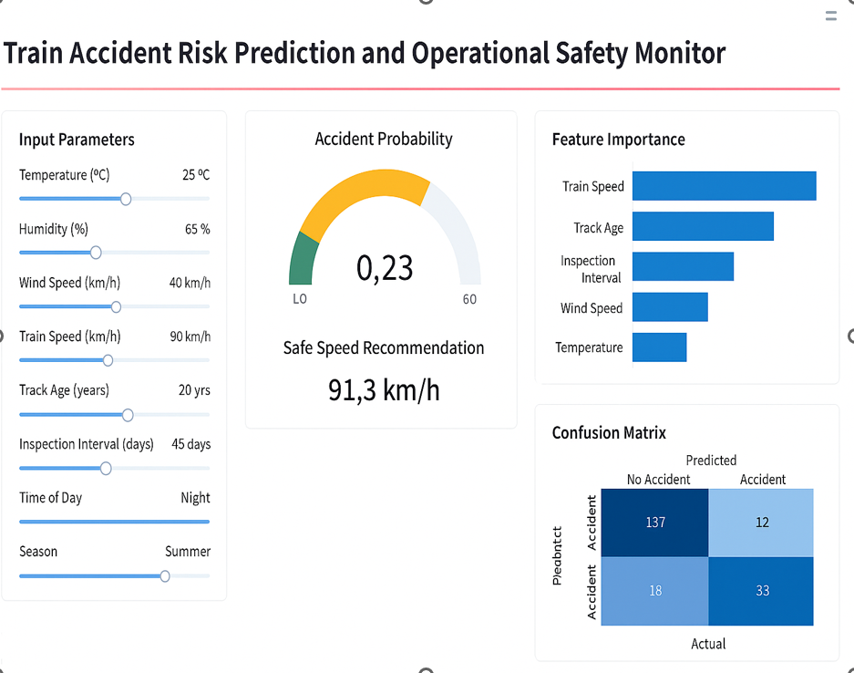
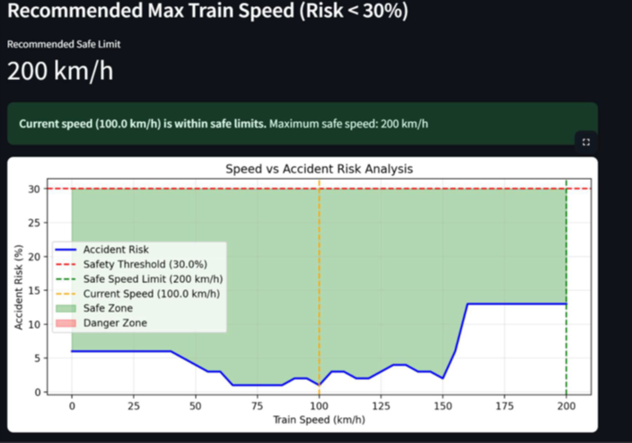
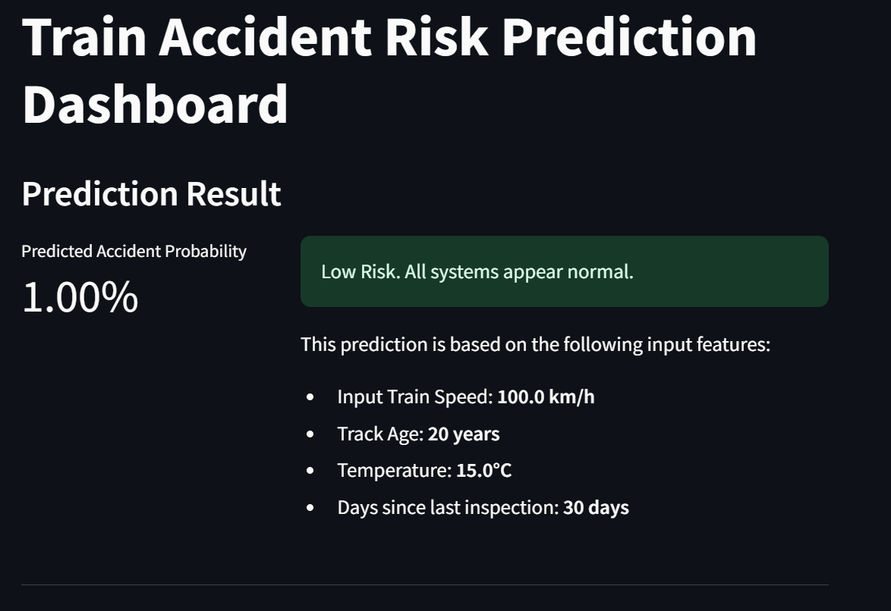

# Train Accident Risk Prediction System

## Overview
This project is a Machine Learning based system that predicts train accident risk using operational and environmental parameters.

It uses a Random Forest model and provides real-time risk analysis through a Streamlit dashboard.

---

## Key Features
- Accident probability prediction (%)
- Safe speed recommendation
- Risk classification (Low / Moderate / High)
- Speed vs Risk visualization
- Feature importance analysis
- Confusion matrix and performance metrics

---

## Technologies Used
- Python
- Scikit-learn
- Pandas, NumPy
- Streamlit
- Matplotlib, Seaborn

---

## How It Works
1. User inputs parameters:
   - Temperature
   - Train speed
   - Track age
   - Wind speed
   - Inspection delay
2. Model predicts accident probability
3. System calculates safe speed limit
4. Dashboard displays results visually

---

## Model Performance
- Accuracy: ~87–94%
- Strong recall for safety prediction

---

## Project Structure
---
## Output Screenshots

### Dashboard

### Graph

### User inputs

### Results

## Future Improvements
- Integrate real-time IoT sensor data  
- Add GPS-based tracking  
- Deploy as cloud-based system  

---

## Author
Dushyanth Naik  
M.Tech (ECE – Signal Processing)
